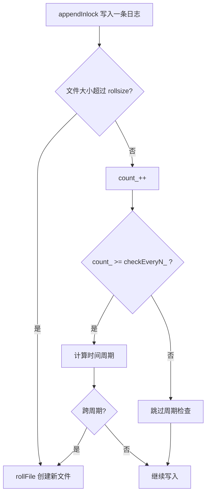

# 异步日志系统教程（单后端写线程）

本文基于当前仓库的实现，面向初学者讲清异步日志系统的核心设计、数据流与面试要点，聚焦“单后端写线程”的实现思路。

## 1. 学习目标

完成本教程后你应该能够：
- 解释为什么高性能系统需要异步日志。
- 描述日志从前端到后端写盘的完整数据流。
- 说明双缓冲与单写线程的作用与优势。
- 在面试中清晰回答设计取舍和关键细节。

## 2. 架构总览（单写线程）


## 3. 关键模块与职责

- 前端日志入口：[include/Logger.h](include/Logger.h)
  - LOG_INFO / LOG_ERROR 等宏对外提供简单接口。
  - 负责拼接日志内容并交给后端。

- 流式缓冲：[include/LogStream.h](include/LogStream.h)
  - 重载 << 操作符，写入小块固定缓冲。

- 固定缓冲区：[include/FixedBuffer.h](include/FixedBuffer.h)
  - 小缓冲用于 LogStream，大缓冲用于异步后端。
  - 减少频繁堆分配带来的开销。

- 异步日志核心：[include/AsyncLogging.h](include/AsyncLogging.h)、[log/AsyncLogging.cc](log/AsyncLogging.cc)
  - 前端 append 写入与缓冲切换。
  - 后端写线程统一落盘。

- 日志文件管理：[include/LogFile.h](include/LogFile.h)、[log/LogFile.cc](log/LogFile.cc)
  - 文件滚动策略与周期性 flush。

- 文件写入实现：[include/FileUtil.h](include/FileUtil.h)、[log/FileUtil.cc](log/FileUtil.cc)
  - 实际 fwrite_unlocked 写入与刷新。

## 4. 数据流（从宏到磁盘）

1. 使用 LOG_INFO 等宏，Logger 生成日志。
2. LogStream 将内容写入小缓冲。
3. AsyncLogging::append 把日志行写到大缓冲。
4. 缓冲满则切换，把旧缓冲放入队列。
5. 后端写线程被唤醒，批量写入磁盘。
6. LogFile 控制滚动与 flush，FileUtil 完成真正写盘。

关键路径可参考 [log/AsyncLogging.cc](log/AsyncLogging.cc)。

## 5. AsyncLogging 核心流程解析

### 5.1 前端 append 路径

文件：[log/AsyncLogging.cc](log/AsyncLogging.cc)

- 每次 append 加锁，判断当前缓冲空间。
- 空间不足时把当前缓冲放入队列并切换新缓冲。
- 通知后端线程进行落盘。

#### 5.1.1 初学者视角：逐行解释 append 的关键逻辑

这段代码的目标是：**让业务线程只做“内存写入”，不要被磁盘 I/O 卡住**。

1. `std::lock_guard<std::mutex> lg(mutex_);`
  - 进入临界区，保护共享的缓冲指针和队列。
  - 这里的锁很短，只包含内存操作，所以开销可控。

2. `if (currentBuffer_->avail() > len)`
  - 检查当前大缓冲是否还有足够空间。
  - 如果能放下，就直接把日志追加进去（纯内存拷贝）。

3. `buffers_.push_back(std::move(currentBuffer_));`
  - 如果放不下，说明当前缓冲“满了”。
  - 把这个满缓冲移动进队列，交给后端写线程统一写盘。

4. `currentBuffer_ = std::move(nextBuffer_);`
  - 尝试用“备用缓冲”顶上来继续写。
  - 这样前端可以立刻继续写日志，不需要等待后端写盘。

5. `currentBuffer_.reset(new LargeBuffer);`
  - 如果备用缓冲也没有（用完了），就临时新建一个。
  - 这属于“兜底策略”，确保日志不会丢。

6. `currentBuffer_->append(logline, len);`
  - 把当前这条日志写入新的缓冲。

7. `cond_.notify_one();`
  - 通知后端写线程：队列里有可写数据了。
  - 后端线程被唤醒后会批量写盘，提高吞吐。

**一句话总结**：前端线程始终只做“内存写入+缓冲切换”，而真正的磁盘写入交给后台线程完成。

面试要点：
- 为什么锁开销可接受？因为只做内存操作，不写盘。
- 为什么用缓冲切换？保证前端性能稳定。

### 5.2 后端单线程写

文件：[log/AsyncLogging.cc](log/AsyncLogging.cc)

- 后端线程条件等待，或超时唤醒。
- 把队列中的缓冲交换到本地，降低锁持有时间。
- 批量写入并按周期 flush。

#### 5.2.1 初学者视角：逐行解释 threadFunc 的关键逻辑

这段代码的目标是：**用一个后台线程批量把缓冲写到磁盘，同时尽量不阻塞前端线程**。

1. `LogFile output(basename_, rollSize_);`
  - 后台线程自己的文件写入对象，负责滚动与落盘。

2. `newbuffer1/newbuffer2` 预分配
  - 后端准备两个“空的大缓冲”，用来替换前端的 `currentBuffer_` 和 `nextBuffer_`。
  - 这样交换时几乎不需要分配内存，降低抖动。

3. `BufferVector buffersToWrite;`
  - 后端本地待写队列。
  - 通过“交换”把前端队列搬过来，缩短持锁时间。

4. `while (running_) { ... }`
  - 后台线程循环工作，直到停止。

5. `cond_.wait_for(lg, 3s)`
  - 如果前端没有新数据，等待条件变量或超时唤醒。
  - 超时唤醒可以保证日志定期 flush，不至于长时间不写盘。

6. `buffers_.push_back(std::move(currentBuffer_));`
  - 无论是否有新日志，都把当前缓冲交给后端处理。
  - 这样可以把已有数据及时写出去。

7. `currentBuffer_ = std::move(newbuffer1);`
  - 立刻给前端换上一个空缓冲。
  - 前端可以继续写日志，不必等待后端写盘。

8. `if (!nextBuffer_) nextBuffer_ = std::move(newbuffer2);`
  - 保障前端的“备用缓冲”也存在，防止前端写入时无缓冲可用。

9. `buffersToWrite.swap(buffers_);`
  - 用交换把前端队列搬到后端本地，锁内操作很快。
  - 之后写盘在锁外执行，避免阻塞前端。

10. `for (auto &buffer : buffersToWrite) output.append(...);`
   - 逐个把缓冲写入文件，是真正的磁盘 I/O。

11. `if (buffersToWrite.size() > 2) buffersToWrite.resize(2);`
   - 如果写入过快堆积太多缓冲，只保留两个备用缓冲，其余直接丢弃引用。
   - 这样可以防止内存无限增长。

12. 复用空缓冲
   - 把写完的缓冲 reset 成空缓冲，再作为 newbuffer1/newbuffer2 备用。
   - 减少重复分配，提高稳定性。

13. `output.flush();`
   - 每轮循环都刷盘，保证数据尽快落地。

**一句话总结**：后端线程通过“交换缓冲 + 批量写盘”实现高吞吐，同时把锁的持有时间压到最短，保证前端线程几乎只做内存操作。

面试要点：
- 单线程写保证日志顺序，避免写入竞争。
- 只在交换缓冲时持锁，避免写盘阻塞前端。

### 5.3 滚动与 flush 策略

文件：[log/LogFile.cc](log/LogFile.cc)

- 按大小滚动：达到 rollsize 触发新文件。
- 按时间滚动：跨天时触发新文件。
- 按间隔 flush：定期落盘，平衡性能与可靠性。

#### 5.3.1 初学者视角：逐行解释 rollFile 的关键逻辑

这段代码的目标是：**在合适的时间创建一个新的日志文件，避免单文件过大并保持日志可管理**。

1. `std::string filename = getLogFileName(basename_, &now);`
  - 根据当前时间生成一个带时间戳的文件名，例如 `basename.20260504-120000.log`。
  - 同时把当前时间写到 `now` 中。

2. `time_t start = now / kRollPerSeconds_ * kRollPerSeconds_;`
  - 把当前时间对齐到“日志周期”的起点。
  - 例如按天滚动时，`start` 就是当天 0 点。

3. `if (now > lastRoll_) { ... }`
  - 判断是否需要滚动：如果当前时间比上次滚动时间更晚，就允许创建新文件。
  - 避免重复创建同一时刻的文件。

4. `lastFlush_ = now; lastRoll_ = now; startOfPeriod_ = start;`
  - 更新内部状态，记录最新的刷新时间、滚动时间与当前周期起点。
  - 这些值会影响后续的滚动与 flush 判断。

5. `file_.reset(new FileUtil(filename));`
  - 创建新的文件写入对象，让 `file_` 指向新日志文件。
  - 之后的日志都会写进这个新文件。

6. `return true;` / `return false;`
  - 成功滚动返回 `true`，否则返回 `false`。

**一句话总结**：`rollFile` 负责“生成新文件名 + 更新状态 + 切换写入目标”，确保日志文件按时间/大小被合理切分。

#### 5.3.2 初学者视角：appendInlock 中的滚动判断逻辑

这段逻辑的目标是：**在写入日志时检查是否需要滚动或刷新**。

1. `file_->append(data, len);`
  - 先把日志写入当前文件。

2. `++count_;`
  - 写入计数加一，用于“每写 N 次才做一次检查”的节流。

3. `if (file_->writtenBytes() > rollsize_)`
  - 按大小滚动：如果当前文件大小超过阈值，就创建新文件。
  - 这是最直接的触发条件。

4. `else if (count_ >= checkEveryN_) { ... }`
  - 如果写入次数达到阈值，再做“按时间滚动”的检查。
  - 用这种节流方式减少频繁系统调用。

5. `time_t thisPeriod = now / kRollPerSeconds_ * kRollPerSeconds_;`
  - 把当前时间对齐到滚动周期起点（例如当天 0 点）。

6. `if (thisPeriod != startOfPeriod_) rollFile();`
  - 如果周期发生变化（跨天/跨周期），就滚动新文件。

7. `if (now - lastFlush_ > flushInterval_) { ... }`
  - 刷新判断：如果距离上次 flush 超过间隔，就刷新到磁盘。
  - 这一步与滚动独立，保证日志不会长期滞留在缓冲。

**一句话总结**：`appendInlock` 每次写入后按“大小优先、时间次之”的策略判断是否滚动，同时按固定间隔刷新，提高可靠性。

#### 5.3.3 为什么要设计 `checkEveryN_`

`checkEveryN_` 的核心作用是**降频检查**：日志写入非常频繁，如果每次写入都去检查时间周期或做系统调用，会带来明显的 CPU 与时间函数开销。

常见好处：
- 把“按时间滚动”的检查从“每条日志一次”降到“每 N 条一次”。
- 降低 `time()` 与周期计算的调用频率，提升吞吐。
- 在性能与滚动准确性之间取得平衡（N 越大，检查越少，越快，但滚动会有少量延迟）。

下面是简化流程图，展示 `checkEveryN_` 在写入路径中的位置：



面试要点：
- 滚动避免单文件过大，便于运维。
- flush 间隔是性能与丢日志风险的权衡。

#### 5.3.4 日志是怎么刷新的

系统中有两条“刷新”路径：

1. **LogFile 层的定时刷新**
  - 在 `appendInlock` 中，每次写入都会检查 `now - lastFlush_`。
  - 超过 `flushInterval_` 就调用 `file_->flush()` 把缓冲刷到磁盘。

2. **AsyncLogging 后端线程的周期刷新**
  - 后端线程每轮写完 `buffersToWrite` 都会执行 `output.flush()`。
  - 即使没有新日志，`wait_for` 超时也会唤醒并刷新一次，避免长时间不落盘。

#### 5.3.5 遇到异常错误时如何尽量保证不丢日志

需要先说明：**异步日志无法做到 100% 不丢**，只能尽量降低丢失概率。

当前实现中的“尽量保证”包括：
- **定期 flush**：`flushInterval_` 控制写入落盘的最大延迟。
- **后端循环刷盘**：每轮写入后立刻刷新，减少缓冲滞留。
- **FATAL 时强制 flush**：Logger 遇到 `FATAL` 会调用 flush 并终止进程，尽量把最后日志写出去。

仍可能丢失的场景：
- 进程被 `SIGKILL` 强制杀死，无法执行 flush。
- 机器掉电或系统崩溃，内存缓冲未写入磁盘。

如果要进一步降低丢失风险，可以考虑：
- 缩短 `flushInterval_`（代价是性能下降）。
- 在关键路径手动调用 flush。
- 重要日志使用同步写入或单独通道。

## 6. 为什么选择单写线程

- 磁盘 I/O 通常是瓶颈，多线程写同一文件会争用锁。
- 单线程写保证顺序性，调试与排障更清晰。
- 实现更简单，正确性更容易保证。

如果需要多路输出，建议每个输出一个独立线程，而不是多个线程写同一文件。

## 7. 运行性能测试

使用脚本：

```bash
scripts/run_log_tests.sh bench
scripts/run_log_tests.sh stress
```

输出字段含义：
- throughput_mibps：吞吐量（MiB/s）
- avg_append_us：append 平均耗时（微秒）
- duration_s：运行时间（秒）
- total_mib：写入总量（MiB）

## 8. 性能测试表格（仅表头）

请在实际实验后填写数据：

| 用例 | 线程数 | 消息数 | 单条大小(Bytes) | flush(s) | roll(Bytes) | 时长(s) | 总写入(MiB) | 吞吐(MiB/s) | avg_append(us) | 备注 |
| --- | --- | --- | --- | --- | --- | --- | --- | --- | --- | --- |

## 9. 常见面试问题与答题思路

1. 为什么要异步日志？
   - 避免业务线程被磁盘 I/O 阻塞。

2. 为什么要双缓冲？
   - 降低前端写入阻塞，保证吞吐稳定。

3. 如何保证日志可靠性？
   - 定期 flush，线程退出时强制 flush。

4. 为什么选择单写线程？
   - 保序、低竞争、更易维护。

5. 异步日志的代价是什么？
   - 写入延迟增加，崩溃时可能丢失少量尾部日志。

## 10. 可扩展方向

- 多输出 sink（文件 + 控制台 + 远端）。
- 结构化日志（JSON）。
- 有界队列与背压策略。
